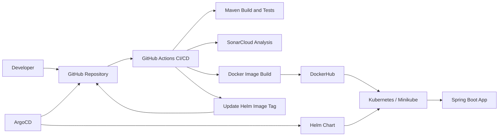

# Architecture Overview

This guide explains what the starter kit is doing and how the pieces fit together.

Back to: [README](README.md) | [Quick Start](QUICKSTART.md) | [Dependencies](DEPENDENCIES.md)

## Big Picture



The important idea: Git describes what should be deployed, and ArgoCD keeps Kubernetes matching Git.

## Key Concepts

| Concept | Simple explanation |
| --- | --- |
| Docker image | A packaged version of the app that can run the same way in different environments |
| DockerHub | A registry where Docker images are stored and downloaded from |
| Kubernetes | The system that runs the app containers |
| Minikube | A small local Kubernetes cluster for learning and testing |
| Helm | A packaging format for Kubernetes configuration |
| ArgoCD | A GitOps tool that watches Git and updates Kubernetes |
| GitOps | A workflow where Git is the source of truth for deployments |
| GitHub Actions | The automation that builds, tests, scans, publishes, and updates deployment values |
| SonarCloud | Optional code quality scanning in CI |

## Local Setup Flow

When you run:

```bash
make setup
```

the project does this:

1. Checks that required tools are installed.
2. Starts Minikube using the `devops-starter-kit` profile.
3. Creates the Kubernetes namespaces.
4. Installs ArgoCD.
5. Creates an ArgoCD Application from your `.env` values.
6. ArgoCD deploys the demo app using the Helm chart.

This is why the first phase is useful: it proves your machine can run the DevOps stack before you connect personal accounts.

## CI/CD Flow

After you connect your own repository and DockerHub account, the deployment flow is:

```text
code change -> git push -> GitHub Actions -> Docker image -> ArgoCD -> Kubernetes deployment
```

What happens step by step:

| Step | What happens |
| --- | --- |
| Code change | You change the app or configuration |
| `git push` | Your changes go to GitHub |
| GitHub Actions | CI builds and tests the Spring Boot app |
| SonarCloud | Optional quality scan runs if SonarCloud is configured |
| Docker image | CI packages the app and publishes the image to DockerHub |
| Helm value update | CI updates the image repository/tag in `helm/starter-app/values.yaml` |
| ArgoCD sync | ArgoCD sees the Git change and updates Kubernetes |
| Kubernetes deployment | Kubernetes runs the updated app image |

Docker image publishing simply means the app is built into a reusable package and uploaded to DockerHub. Kubernetes can then pull that image and run it.

If DockerHub secrets are not configured, the workflow still builds and tests the app, but it skips Docker publishing and GitOps image tag updates.

## ArgoCD and GitOps

ArgoCD is the bridge between Git and Kubernetes.

In this repo:

- Git stores the Helm chart and desired image values.
- ArgoCD watches the Git repository and chart path.
- Kubernetes runs what ArgoCD applies.
- If the Git values change, ArgoCD can sync the cluster to match.

That is GitOps: instead of manually changing the cluster, you change Git and let automation update the cluster.

## Helm Configuration

The Helm chart works with the demo defaults and can be reused for other Spring Boot services.

Key values:

| Value | Purpose |
| --- | --- |
| `fullnameOverride` | Predictable Kubernetes resource name |
| `namespace.name` | Target namespace |
| `replicaCount` | Number of pods |
| `image.repository` | Docker image repository, default `axthithya/devops-starter-kit` |
| `image.tag` | Docker image tag |
| `image.pullPolicy` | Kubernetes image pull policy |
| `container.port` | Spring Boot container port |
| `service.type` | `ClusterIP`, `NodePort`, or `LoadBalancer` |
| `service.port` | Service port |
| `service.nodePort` | Optional fixed NodePort |
| `probes.*` | Readiness and liveness checks |
| `resources` | CPU/memory requests and limits |

Render the chart locally:

```bash
make helm-template
```

Rendering does not deploy anything. It shows the Kubernetes YAML that Helm would produce.

## Health Checks

The app exposes:

```text
GET /
GET /health
```

The Helm chart uses `/health` for readiness and liveness probes. In beginner terms, Kubernetes uses that endpoint to decide whether the app is ready to receive traffic and whether it should keep running.

`make verify` also checks Docker, Kubernetes, ArgoCD, the ArgoCD Application, the app deployment, the service, optional SonarCloud values, and workflow presence.

## Useful Kubernetes and ArgoCD Commands

Check ArgoCD pods:

```bash
kubectl get pods -n argocd
```

Check ArgoCD Applications:

```bash
kubectl get applications -n argocd
```

Open the ArgoCD UI locally:

```bash
kubectl port-forward svc/argocd-server -n argocd 8080:443
```

Get the initial admin password:

```bash
kubectl -n argocd get secret argocd-initial-admin-secret \
  -o jsonpath='{.data.password}' | base64 -d && echo
```

Then open `https://localhost:8080` and log in with username `admin`.
