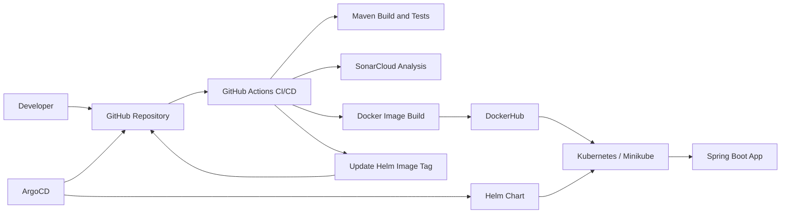
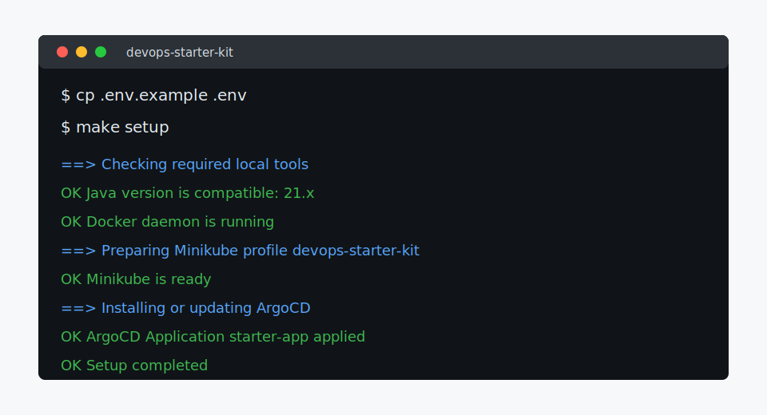
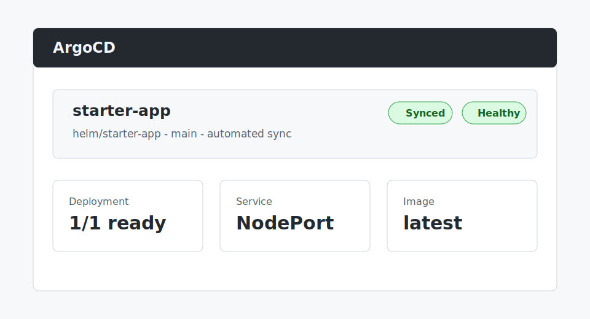

# DevOps Starter Kit


A production-inspired DevOps starter platform for Spring Boot applications. It gives you a working path from local development to container build, quality scan, DockerHub publish, Helm deployment, and ArgoCD GitOps sync on Kubernetes.

The goal is a beginner-friendly workflow:

```text
git clone https://github.com/axthithya/devops-starter-kit.git
cd devops-starter-kit
cp .env.example .env
make setup
make open-app
```

Clone this repository directly. You do not need to create a GitHub template or another repository before trying the starter kit locally.

## Architecture



## Screenshots

| Local setup | ArgoCD health |
| --- | --- |
|  |  |

## Tech Stack

| Layer | Tooling |
| --- | --- |
| Application | Java 21, Spring Boot, Maven |
| Container | Docker, DockerHub |
| CI/CD | GitHub Actions |
| Code quality | SonarCloud |
| Kubernetes packaging | Helm |
| GitOps | ArgoCD |
| Local cluster | Minikube |
| Automation | Bash scripts, Makefile |

## Repository Layout

```text
.
|-- app/                    # Spring Boot application and Dockerfile
|-- argocd/                 # ArgoCD Application reference and generated manifest target
|-- helm/starter-app/       # Reusable Spring Boot Helm chart
|-- scripts/                # Setup, validation, bootstrap, health, cleanup
|-- docs/screenshots/       # README visual assets
|-- .github/workflows/      # GitHub Actions pipeline
|-- .env.example            # Copyable local configuration with runnable demo defaults
|-- Makefile                # Beginner-friendly command surface
`-- README.md
```

## Quickstart

This path is for a new user who wants the fastest working result. You need Git, Java 21, Docker, kubectl, Helm, and Minikube installed; `make setup` checks them before it changes your cluster.

### 1. Clone this repository

```bash
git clone https://github.com/axthithya/devops-starter-kit.git
cd devops-starter-kit
cp .env.example .env
```

For a first local demo, you can leave `.env` unchanged. The scripts use your clone's `origin` remote for ArgoCD and the public demo image for Kubernetes:

```bash
GIT_REPO_URL=
DOCKERHUB_USERNAME=axthithya
DOCKER_IMAGE_NAME=devops-starter-kit
APP_NAME=starter-app
APP_NAMESPACE=starter-app
```

Only edit `.env` now if you already know your own DockerHub, GitHub, app, namespace, or SonarCloud values. SonarCloud placeholders are allowed for local setup and only matter when you enable CI quality scanning.

### 2. Run setup

```bash
make setup
```

This verifies tools, starts the `devops-starter-kit` Minikube profile, creates namespaces, installs ArgoCD, and registers the app. A successful run ends like this:

```text
OK  Setup completed
```

ArgoCD may need a minute or two to sync the app after setup finishes.

### 3. Verify and open the app

```bash
make verify
make open-app
```

`make open-app` prints the local URL for the NodePort service. Open that URL in your browser, or test it with `curl`.

### 4. Use your own repository and DockerHub image

The starter kit is directly usable from this clone, but external users cannot push to the original `axthithya/devops-starter-kit` repository. When you are ready to run CI/CD for your own copy, create a GitHub repository or fork, then point your local clone and `.env` at it:

```bash
git remote set-url origin https://github.com/<your-github-username>/<your-repository>.git
```

Edit `.env`:

```bash
GIT_REPO_URL=https://github.com/<your-github-username>/<your-repository>.git
DOCKERHUB_USERNAME=<your-dockerhub-username>
DOCKER_IMAGE_NAME=devops-starter-kit
SONAR_ORGANIZATION=your-sonarcloud-organization
SONAR_PROJECT_KEY=your-sonarcloud-project-key
```

Run this after changing `.env` so ArgoCD watches your repository and image:

```bash
make deploy
```

### 5. Add GitHub CI/CD configuration

In GitHub, open `Settings -> Secrets and variables -> Actions`.

Also open `Settings -> Actions -> General -> Workflow permissions` and select `Read and write permissions`. This allows the pipeline to commit the new Helm image tag for ArgoCD.

Add these repository secrets:

| Secret | Purpose |
| --- | --- |
| `DOCKER_USERNAME` | DockerHub username |
| `DOCKER_PASSWORD` | DockerHub access token or password |
| `SONAR_TOKEN` | SonarCloud token, required only when using SonarCloud |

Add these repository variables:

| Variable | Required | Example |
| --- | --- | --- |
| `SONAR_ORGANIZATION` | Only for SonarCloud | `my-sonar-org` |
| `SONAR_PROJECT_KEY` | Only for SonarCloud | `my-org_my-repo` |
| `DOCKER_IMAGE_NAME` | No | `devops-starter-kit` |
| `DOCKERHUB_REPOSITORY` | No | `my-dockerhub-user/devops-starter-kit` |
| `SONAR_HOST_URL` | No | `https://sonarcloud.io` |
| `UPDATE_HELM_IMAGE_TAG` | No | `true` |

If DockerHub secrets are missing, CI still builds and tests the app but skips Docker publish and GitOps tag updates. If SonarCloud values are missing, CI skips the SonarCloud scan with a warning.

### 6. Push to main

```bash
git add .
git commit -m "configure starter kit"
git push origin main
```

GitHub Actions will build and test the app. When DockerHub is configured, it also builds and pushes Docker images, updates the Helm image repository/tag, and lets ArgoCD sync the new image into Kubernetes.

After the first successful pipeline run:

```bash
make verify
make open-app
```

## Prerequisites

Primary support target: Ubuntu/Linux. Secondary target: WSL2 with Docker Desktop WSL integration enabled.

| Tool | Minimum expectation | Check |
| --- | --- | --- |
| Git | Installed and on PATH | `git --version` |
| Java | 21+ | `java -version` |
| Docker | Installed and running | `docker info` |
| kubectl | Installed and on PATH | `kubectl version --client` |
| Helm | Installed and on PATH | `helm version` |
| Minikube | Installed and on PATH | `minikube version` |

Run the dependency validator any time:

```bash
./scripts/verify-dependencies.sh
```

## Make Commands

| Command | What it does |
| --- | --- |
| `make setup` | Full local setup: dependencies, Minikube, ArgoCD, and Application registration |
| `make verify` | Validate Docker, Kubernetes, ArgoCD, app, optional SonarCloud config, workflow |
| `make deploy` | Recreate or refresh the ArgoCD Application from `.env` |
| `make minikube` | Start or verify the Minikube profile |
| `make argocd` | Install or update ArgoCD and apply the Application |
| `make open-app` | Print the local URL for the app service |
| `make cleanup` | Remove app resources while keeping Minikube |
| `make cleanup-all` | Remove app, ArgoCD, and the Minikube profile |
| `make test` | Run Maven verification for the Spring Boot app |
| `make docker-build` | Build the Docker image locally using `.env` values |
| `make helm-template` | Render the Helm chart locally using `.env` values |

## SonarCloud Setup

SonarCloud is optional for the local demo. Enable it when you want CI quality scanning:

1. Sign in to SonarCloud and import your GitHub repository.
2. Copy the organization key and project key into `.env`.
3. Create a SonarCloud token.
4. Add `SONAR_TOKEN` as a GitHub secret.
5. Add `SONAR_ORGANIZATION` and `SONAR_PROJECT_KEY` as GitHub repository variables.

The workflow reads SonarCloud identity from GitHub variables, so no organization or project key is hardcoded in the pipeline.

## ArgoCD Setup

`make setup` installs ArgoCD into the namespace from `.env` using Kubernetes server-side apply, then applies an ArgoCD Application generated from your local configuration.
Server-side apply keeps the official ArgoCD CRDs off the client-side last-applied annotation path, which avoids annotation-size failures on newer Kubernetes and Minikube clusters.

Useful commands:

```bash
kubectl get pods -n argocd
kubectl get applications -n argocd
kubectl port-forward svc/argocd-server -n argocd 8080:443
```

Get the initial admin password:

```bash
kubectl -n argocd get secret argocd-initial-admin-secret \
  -o jsonpath='{.data.password}' | base64 -d && echo
```

Then open `https://localhost:8080` and log in with username `admin`.

## Helm Configuration

The chart works with the demo defaults and is reusable for other Spring Boot services. Key values:

| Value | Purpose |
| --- | --- |
| `fullnameOverride` | Predictable Kubernetes resource name |
| `namespace.name` | Target namespace |
| `replicaCount` | Number of pods |
| `image.repository` | Docker image repository, default `axthithya/devops-starter-kit` |
| `image.tag` | Docker image tag |
| `image.pullPolicy` | Kubernetes image pull policy |
| `container.port` | Spring Boot container port |
| `service.type` | `ClusterIP`, `NodePort`, or `LoadBalancer` |
| `service.port` | Service port |
| `service.nodePort` | Optional fixed NodePort |
| `probes.*` | Readiness and liveness checks |
| `resources` | CPU/memory requests and limits |

Render locally:

```bash
make helm-template
```

## Health Checks

The app exposes:

```text
GET /
GET /health
```

The Helm chart uses `/health` for readiness and liveness probes. `make verify` also checks Docker, Kubernetes, ArgoCD, the ArgoCD Application, app deployment, service, optional SonarCloud values, and workflow presence.

## Troubleshooting

| Problem | Fix |
| --- | --- |
| `.env` missing | Commands create `.env` from `.env.example` automatically; you can also run `cp .env.example .env` yourself |
| Docker not reachable | Start Docker Engine/Desktop and verify `docker info` |
| WSL2 cannot reach Docker | Enable Docker Desktop WSL integration for your distro |
| Minikube fails to start | Check Docker is running, then run `minikube delete -p devops-starter-kit` and retry |
| ArgoCD Application is `Missing` | Verify your git `origin`, or set `GIT_REPO_URL` explicitly with `GIT_TARGET_REVISION` and `HELM_CHART_PATH` in `.env` |
| Image pull fails | Check DockerHub repo visibility and `DOCKERHUB_USERNAME`/`DOCKER_IMAGE_NAME` values |
| SonarCloud fails in CI | Confirm `SONAR_TOKEN`, `SONAR_ORGANIZATION`, and `SONAR_PROJECT_KEY` |
| GitOps commit fails | Give GitHub Actions read/write workflow permissions or set `UPDATE_HELM_IMAGE_TAG=false` |
| NodePort collision | Leave `NODE_PORT` blank so Kubernetes chooses a free port |

## Cleanup

Remove the app and ArgoCD Application while keeping Minikube:

```bash
make cleanup
```

Remove the app, ArgoCD, and Minikube profile:

```bash
make cleanup-all
```

## FAQ

**Can I use this for another Spring Boot app?**

Yes. Replace the code under `app/`, keep the Dockerfile or adapt it, then update `.env` and Helm values.

**Do I need to use GitHub's template button first?**

No. Clone this repository directly. Create or fork your own GitHub repository only when you are ready to push your customized copy and run your own CI/CD.

**Do I need to manually edit Kubernetes YAML?**

For the normal path, no. Configure `.env` locally and GitHub variables/secrets in CI.

**Why does the workflow update `helm/starter-app/values.yaml`?**

That gives ArgoCD a Git change to sync after a new Docker image is published. Disable it with `UPDATE_HELM_IMAGE_TAG=false`.

**Can I use a private DockerHub repository?**

Yes, but your Kubernetes cluster needs image pull credentials. Add `imagePullSecrets` in Helm values.

**Does this replace production Kubernetes?**

No. Minikube is for local learning and demos. The same Helm and ArgoCD pattern can be adapted to managed clusters.

## Contributing

Contributions are welcome. Keep changes beginner-friendly and automation-first:

1. Open an issue or describe the problem in your pull request.
2. Keep defaults safe for local Minikube.
3. Avoid hardcoded personal values outside the documented demo defaults.
4. Update docs when changing setup behavior.
5. Run `make test` and `make helm-template` before opening a pull request.

## License

This project is released under the MIT License. See [LICENSE](LICENSE).
